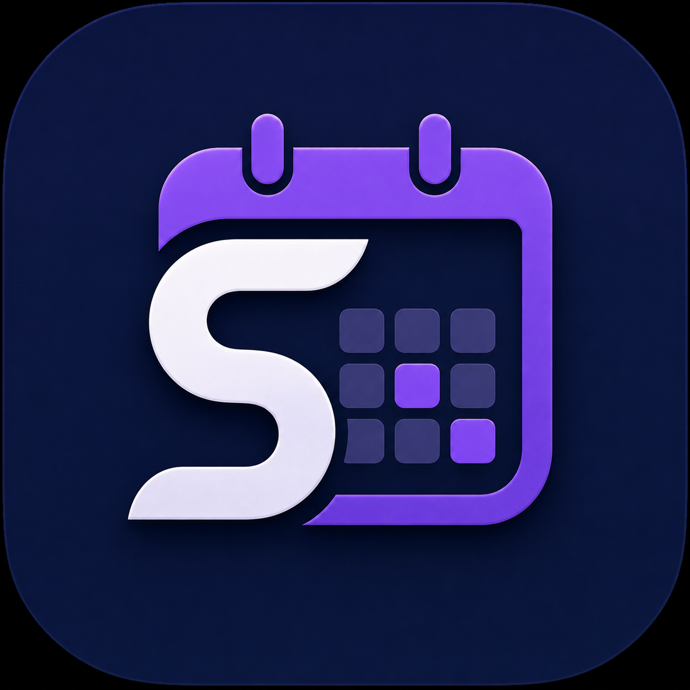

<div align="center">



# StepPilot

### Moderne Mitarbeiter- und Schichtplanung für Unternehmen

**Planen · Koordinieren · Informieren · Auswerten**


</div>

---

## Über StepPilot

**StepPilot** ist eine mandantenfähige Webanwendung für die digitale Mitarbeiter- und Schichtplanung. Sie bildet typische Abläufe aus der betrieblichen Personalplanung in einer zentralen Anwendung ab – von der Mitarbeiterverwaltung über die Dienstplanung bis zu Abwesenheiten, Schichttausch, Benachrichtigungen und Auswertungen.

Das Projekt wurde als praxisnahes Portfolio-Projekt entwickelt und legt besonderen Wert auf eine klare Rollenverteilung, Mandantentrennung und realistische Workflows.

> **Ziel:** Weniger organisatorischer Aufwand, bessere Übersicht und eine zentrale Anlaufstelle für Planung und Mitarbeiter.

## Highlights

| Bereich | Funktionen |
| --- | --- |
| **Dienstplanung** | Wochenbasierte Planung, Schichtvorlagen, automatische Planung und Konfliktprüfung |
| **Mitarbeiter** | Mitarbeiter, Standorte, Abteilungen, Qualifikationen und Benutzerkonten |
| **Self-Service** | Eigene Schichten, Verfügbarkeiten, offene Schichten und Schichttausch |
| **Abwesenheiten** | Urlaub, Krankheit und weitere Abwesenheiten mit Genehmigungsworkflow |
| **Kommunikation** | In-App-Benachrichtigungen bei wichtigen Planungsereignissen |
| **Management** | Handlungszentrum, Planqualitätsprüfung und Auswertungen |
| **Reporting** | Soll-/Ist-Stunden, Auslastung, Besetzungsgrad und CSV-Export |
| **UX** | Modernes responsives UI sowie Dark und Light Mode |

## Funktionsumfang

- Mitarbeiterverwaltung
- Standorte und Abteilungen
- Qualifikationen
- Schichtvorlagen und Schichtpräferenzen
- Wochenbasierte Dienstplanung
- Automatische Schichtplanung mit Konfliktprüfung
- Veröffentlichung von Dienstplänen
- Persönliche Ansicht **„Meine Schichten“**
- Verfügbarkeiten
- Urlaubs- und Abwesenheitsverwaltung
- Offene Schichten und freiwillige Übernahmeanfragen
- Schichttausch zwischen Mitarbeitern
- Genehmigungsworkflows für Planung und Verwaltung
- In-App-Benachrichtigungen
- Handlungszentrum für offene Personalentscheidungen
- Planqualitätsprüfung
- Auswertungen zu Soll-/Ist-Stunden, Auslastung und Besetzungsgrad
- CSV-Export
- Dark Mode und Light Mode
- Rollen- und mandantenbasierte Zugriffskontrolle

## Rollen & Berechtigungen

| Rolle | Aufgabe |
| --- | --- |
| **SuperAdmin** | Unternehmen verwalten und privaten Administrations-/Testbereich nutzen |
| **Owner** | Unternehmensverantwortung und umfangreiche Verwaltungsrechte |
| **Admin** | Mitarbeiter und Benutzerkonten verwalten |
| **Planner** | Operative Schicht- und Personalplanung |
| **Employee** | Eigene Schichten, Verfügbarkeiten, offene Schichten und Tauschanfragen verwalten |

Unternehmen registrieren sich nicht selbst. Neue Unternehmen werden ausschließlich durch den **SuperAdmin** angelegt.

## Typischer Workflow

```text
Unternehmen anlegen
        ↓
Mitarbeiter & Benutzerkonten verwalten
        ↓
Standorte / Abteilungen / Qualifikationen definieren
        ↓
Schichten planen und prüfen
        ↓
Dienstplan veröffentlichen
        ↓
Mitarbeiter werden informiert
        ↓
Abwesenheiten / offene Schichten / Schichttausch bearbeiten
        ↓
Planqualität und Auswertungen kontrollieren
```

## Sicherheit & Mandantentrennung

StepPilot trennt Unternehmensdaten über die jeweilige `CompanyId`. Geschützte Bereiche kombinieren Rollenprüfungen mit einem zentralen `TenantGuard`, sodass normale Benutzer ausschließlich auf Daten ihres eigenen Unternehmens zugreifen können.

Zusätzlich prüft die zentrale Autorisierung, ob das Benutzerkonto und das zugeordnete Unternehmen aktiv sind. Für Nicht-Entwicklungsumgebungen werden detaillierte Blazor-Fehler deaktiviert und grundlegende HTTP-Sicherheitsheader gesetzt.

## Technologie

| Technologie | Einsatz |
| --- | --- |
| **ASP.NET Core / Blazor** | Webanwendung und UI-Logik |
| **C#** | Backend- und Anwendungslogik |
| **Entity Framework Core** | Datenzugriff und Migrationen |
| **SQL Server / LocalDB** | Persistente Datenhaltung |
| **ASP.NET Core Identity** | Login, Benutzer und Rollen |
| **MudBlazor** | UI-Komponenten und Design |

## Projektstruktur

```text
StepPilot/
├── Components/       # Razor-Komponenten, Layout und Seiten
├── Data/             # DbContext, Models, Rollen und Migrationen
├── Services/         # Geschäftslogik und zentrale Services
├── wwwroot/          # Styles, JavaScript und Branding
├── Program.cs        # Anwendungskonfiguration
└── README.md
```

## Lokal starten

### Voraussetzungen

- zum Projekt passende aktuelle .NET-SDK-Version
- SQL Server LocalDB oder kompatible SQL-Server-Instanz
- Visual Studio oder eine andere .NET-IDE

### 1. Repository klonen

```bash
git clone https://github.com/Pexiz96/StepPilot.git
cd StepPilot
```

### 2. Abhängigkeiten wiederherstellen

```bash
dotnet restore
```

### 3. Datenbank vorbereiten

In der Package Manager Console von Visual Studio:

```powershell
Update-Database
```

Alternativ mit installierten EF-Core-Tools:

```bash
dotnet ef database update
```

### 4. Anwendung starten

```bash
dotnet run
```

## Projektstatus

**StepPilot befindet sich aktuell auf dem Portfolio-/Version-1.0-Stand.** Die zentralen Prozesse einer Mitarbeiter- und Schichtplanung sind umgesetzt und die Anwendung dient als demonstrierbares Full-Stack-/Business-Software-Projekt.

Für einen realen produktiven SaaS-Betrieb wären unter anderem weitere Maßnahmen sinnvoll:

- produktionsreifes Deployment und Secret-Management
- echter E-Mail-Versand
- automatisierte Unit-, Integrations- und End-to-End-Tests
- Monitoring und Logging-Konzept
- Backup- und Wiederherstellungsstrategie
- erweiterte Datenschutz- und Betriebsmaßnahmen

## Was dieses Projekt demonstriert

StepPilot zeigt unter anderem praktische Kenntnisse in:

`C#` · `Blazor` · `ASP.NET Core` · `Entity Framework Core` · `SQL Server` · `Identity` · `Rollen & Autorisierung` · `Mandantenfähigkeit` · `Business-Workflows` · `UI/UX`

---

<div align="center">

**StepPilot – Schichtplanung mit Überblick.**

Portfolio-Projekt · Version 1.0

</div>
